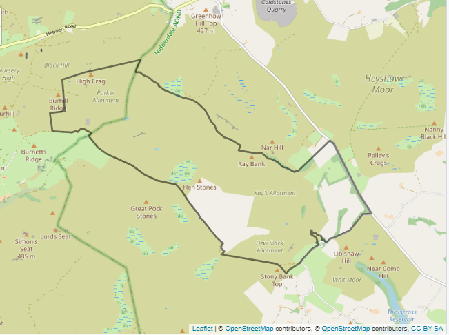
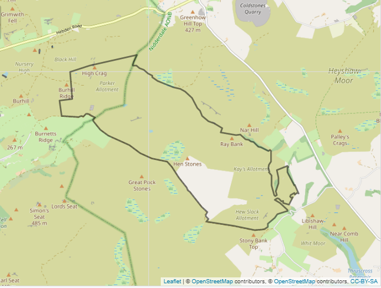

## 1. Define the study area

#### DefineStudyArea.R
* This script defines the boundaries of the study region.  
* It takes a shapefile for the area of interest, and trims this to the Moorland Line shapefile to ensure that no area outside of the Moorland Line (i.e. not peatland) is included.

  

Figure 1. Study Area before (left) and after (right) trimming to Moorland Line 

#### DefinePtsWithinRegion_withCovariateValues.R
* Takes raster files containing slope and elevation values over a wider area and trims these to the boundaries of the study region.  
* Convert these trimmed rasters to dataframes, in which lat/long values (the centre of the raster cells) are associated with a slope and elevation value.  
* Join the slope and elevation dataframes together.  
* This results in a dataframe containing locations within the study area at 5m intervals with slope and elevation values
