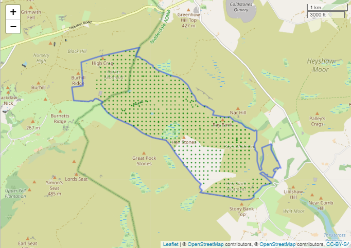
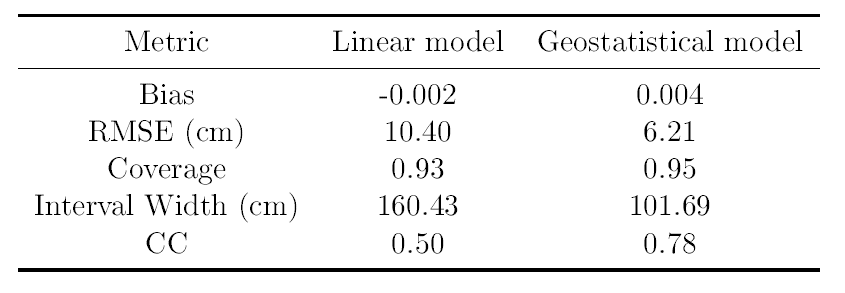
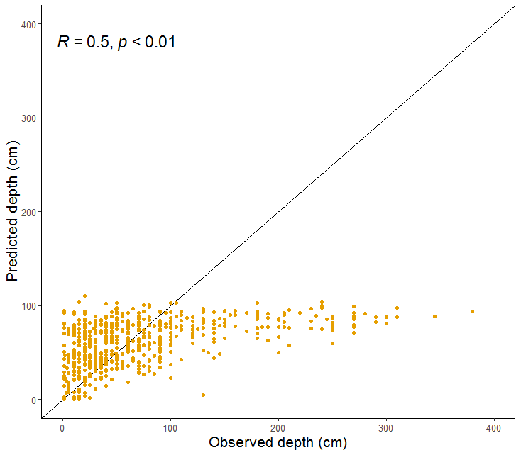
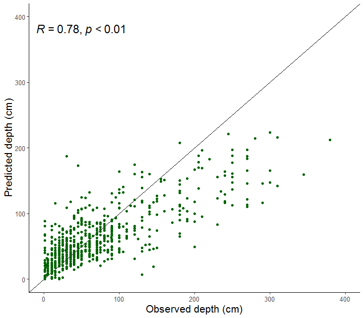

## Assessing model accuracy with cross-validation
The "RunCrossValidation.R" script assesses the performance of both a linear and geostatistical model for predicting depth across a study area, using 10-fold cross-validation.

#### Model training data

The models are fitted using a sample of points with peat depth measurements.  The locations of these samples are shown in Figure 1.  
These samples are primarily collected on a regularly spaced grid, however, there are some gaps in the grid and some sample points that are more clustered together.  
This sample has been joined with slope and elevation data, and these variables are used as the predictor variables. The square root of depth is the response variable.   

Figure 1. Location of peat depth measurements within study area 

The peat depth sample being used here contains some duplicated points and some very geographically close points. The script contains an option to remove these points.  
The script also contains an option to carry out the cross-validation using the sample data in either British National Grid (BNG) or WGS84 projection. Currently, if the model is run in BNG the geostatistical model doesn't work properly and gives the same results to the linear model. Still not sure why this is.

#### Assessing model accuracy
The results of the cross-validation are used to create a table of results containing the following metrics, for both the linear and the geostatistical model:
* Bias
* Root Mean Squared Error (RMSE)
* Coverage
* Prediction interval width 
* Correlation Coefficient  

These results tables are saved in csv files.

Predicted values vs. observed values are also plotted.  
For each point where depth was measured, this depth is the observed value and the predicted value is the mean of the values predicted across the cross-validation runs.

### Results
The geostatistical model consistently outperformed the corresponding linear model, exhibiting a lower RMSE, higher CC and narrower prediction intervals. For both models, the
coverage probability was just short of the 95% value which was expected and the bias was close to 0 (Table 1).

Table 1. Performance metrics derived from 10-fold cross-validation of both linear and geostatistical
model performance. 

At each sample location, the observed depth was compared with the mean depth prediction from across the 10 cross-validation runs (Fig 5.4). The level of agreement with the 1:1 line was higher for the geostatistical model, corresponding to its higher CC. The linear model's maximum prediction of 110.45cm fell considerably short of the maximum observed value of 380cm, with predictions levelling of ~100cm. Despite achieving a higher maximum prediction of 224.03cm, the geostatistical model also failed to predict depths across the full range of observations. Above ~150cm predictions began to fall systematically below the 1:1 line. Both models predicted unphysical depths below 0cm, which were corrected to 0cm for plotting.

Figure 2. Comparison of observed depths against mean predicted depth obtained across 10 cross-validation runs, along with the 1:1 line. 

