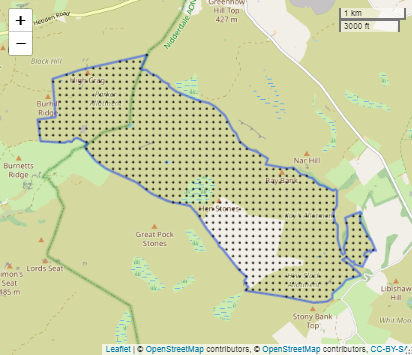
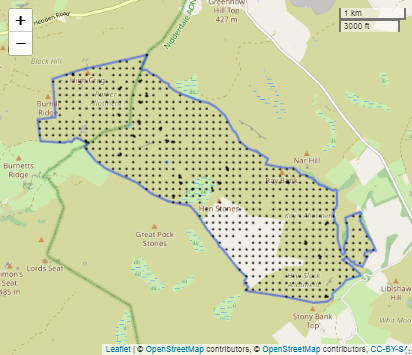
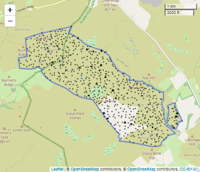
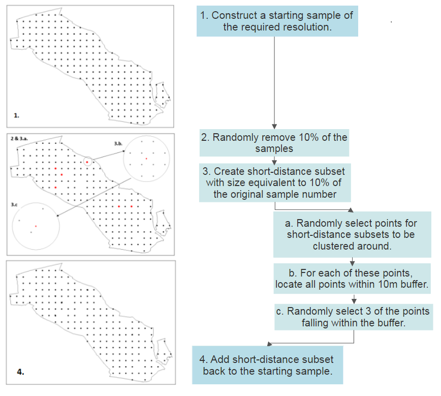
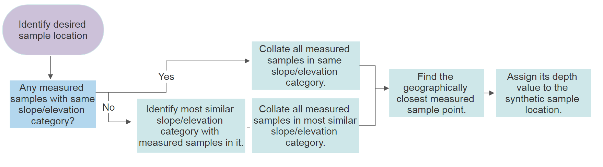

## Assessing impact of depth sampling strategy on model accuracy 
Samples containing points in the following formations are created (and in the following scripts):

* Regular grid (RegularGrid.R)
* Regular grid with short distance subset (RegularGrid_Sr.R)
* Spatial Coverage sample (SPCosa.R)
* Spatial coverage sample with short distance subset (SPCosa_sr.R)

Examples of each are displayed in Figure 1.

  
    
     
       

 Figure 1. Regular grid (1), regular grid with short distance subset (2), spatial coverage sample (3) and spatial coverage sample with short distance subset (4) 

In each case, samples of various sizes (i.e. various numbers of sample points) are defined. Regular grids with spacings of 100m, 150m, 200m and 250m are created and the spatial coverage samples are designed to have sample numbers of equivalent sizes to the number in each of these. 

Collecting manual depth samples using all of these strategies, and various sample sizes, would require an unfeasible amount of time and labour, and so instead, synthetic depths are generated programmatically (using function defined in CreateSyntheticSample_functions.R).  
Both linear and geostatistical model performance is then assessed through cross-validation using these synthetic peat depth datasets.

The purpose of this part of the work is to assess whether model accuracy is influenced by the sampling strategy used. However, model accuracy could be influenced by the exact locations where the synthetic sample points happen to fall (e.g. if, by chance, a sample included lots of points in deep peat then performance of the model might be improved). In order to account for this, 50 variations of each sample configuration and sample size are generated and used in model cross-validation.

### Using R to define sample locations
#### Regular grid
Sample locations were defined on a regular grid using the "makegrid" function in the "gstat" package. This function takes as an input the number of points to include in the grid, this was adjusted until grids of the desired spacing were created. Grids were created over the bounding box of the study area and subsequently trimmed to the boundary of the study area.

#### Regular grid with short distance subset
Regular grids were created, using the method defined above. Subsequently, a small subset of the grid points were selected randomly, and these were used to base short distance clusters around. For each point in this subset, a buffer of Xm was created around the point.
Create a buffer around these points of Xm, and then find the points from the geodataframe of all points within the AOI that fall within this buffer
Randomly select from these points X number of points (depending on number of points to have in each cluster)

#### Spatial coverage sample
Uses stratify function (spcosa) to split the study area into (equally?) sized areas of a specified number.
One sample point is then located within each sub-area. Literature suggests this should be the centroid of each sub-area; however, this does not seem to be what is happening. Not sure why not...

Diss <- "Spatial coverage samples were generated using the spcosa-package in R (Walvoort et al., 2010).
The package uses the k-means clustering algorithm to split the study region into N equally spaced
sub-regions, with one sample positioned randomly in each sub-region (Fig 4.3). Values of N were
chosen to match the sample numbers associated with the grids tested in Section 4.3.1. The algorithm
was run fty times, with a dierent sub-region delineation generated each time."

#### Spatial coverage sample with short distance subset
As above
Randomly select some of the points around which to base short distance clusters
Create a buffer around these points of Xm, and then find the points from the geodataframe of all points within the AOI that fall within this buffer
Randomly select from these points X number of points (depending on number of points to have in each cluster)

  

 Figure 1. Slope (left) and elevation (right) profiles over the study area 

##### Assigning synthetic depth values

  

 Figure 1. Slope (left) and elevation (right) profiles over the study area 

  
